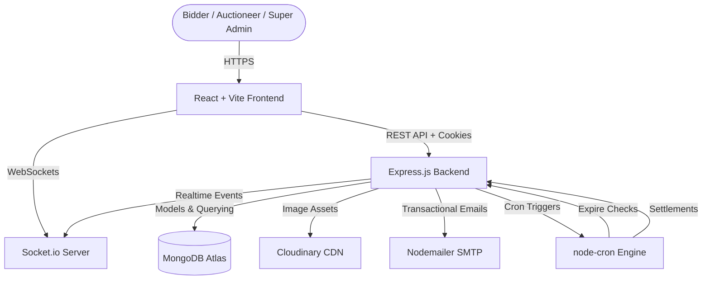
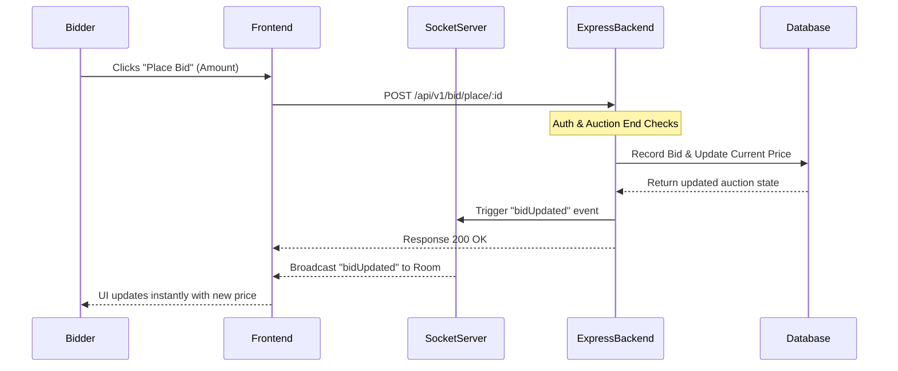

<div align="center">
  <h1>🏆 PrimeBid</h1>

  **A real-time, full-stack live auction platform supporting dynamic bidding, automated cron-job operations, multi-role dashboards, and commission verification workflows.**

  [](https://react.dev/)
  [](https://nodejs.org/)
  [](https://socket.io/)
  [](https://www.mongodb.com/)
  [](https://vite.dev/)
</div>

---

## Project Overview

### Problem Statement

Standard online commerce platforms lack the urgency and excitement of real-time negotiation, dynamic pricing, and immediate customer engagement. Simultaneously, managing live auctions manually presents significant engineering hurdles—including real-time synchronization of bids across users, automated winner determination, commission payouts, and secure payment verification.

### Our Solution

PrimeBid is a feature-rich, high-performance, real-time live auction ecosystem. The system is designed to provide:

1. **Instant Bidding Synchronization** — Built on WebSockets (Socket.io) to ensure bid updates are pushed instantly to all viewing users without manual page refreshes.
2. **Automated Lifecycle Management** — Native cron-jobs check for completed auctions every minute, automatically select the highest bidder, calculate commissions, and dispatch instructions to the winner.
3. **Structured Admin & User Workflows** — Custom dashboards tailored for **Bidders** (bid history, profile statistics), **Auctioneers** (create, delete, republish items, submit commission proof), and **Super Admins** (income tracking, user moderation, settlement approval).
4. **Platform Monetization & Commission Verification** — System-wide platform fees are calculated dynamically. Auctioneers submit proof of settlement which admins verify and clear using background verification pipelines.

---

## System Architecture

### High-Level Architecture



### Real-Time Bidding Sequence



---

## Core Features

### ⚡ Real-Time Bidding Engine
- Socket.io integration establishing persistent bi-directional channels for instant bid broadcasts.
- Automatic bidding locking and validation rules (e.g., checking if the bid is higher than the current bid, validating auction expiry, preventing bidding on one's own item).

### 🙋 Bidder Experience
- Secure authentication via email, credentials, and profile image uploads.
- Home page showcasing currently active auctions and search mechanisms.
- Comprehensive bidding logs, list of won auctions, and real-time leaderboard statistics.

### 📢 Auctioneer Experience
- Setup multiple payout methods (Bank Details, Cards, UPI, Paypal).
- Publish new items with description, condition, starting bid price, end times, and product images.
- Track commission status, submit commission payment proofs directly to the administration.
- Republish expired or unsold items.

### 🛡️ Super Admin Control Center
- Metric trackers reflecting monthly income, registered users, and active auctions.
- Verify payment proof receipts, approve/reject platform fees, and settle auctioneer balances.
- Immediate moderation capabilities (delete items, manage user logs, etc.).

### ⚙️ Automated Platform Workflows
- **Ended Auction Cron (`endedAuctionCron`)**: Runs every minute to sweep ended auctions. It assigns the item to the highest bidder, calculates the platform fee, updates stats, and emails banking details directly to the winning bidder.
- **Commission Settle Cron (`verifyCommissionCron`)**: Automatically processes approved payment proofs, decrements outstanding auctioneer balances, and records platform revenue ledger entries.

---

## Technology Stack

### Frontend
- **React 19** with **Vite 6** for fast hot module reloading and build optimization.
- **Redux Toolkit** for clean client state management and slice architecture.
- **Tailwind CSS** for responsive layout and UI design.
- **Socket.io Client** for real-time websocket connection.
- **Chart.js** & **React-Chartjs-2** for visual metrics in dashboards.
- **React Toastify** for instant user notifications.

### Backend & Database
- **Node.js 20** and **Express 5** (Module Type type imports).
- **MongoDB** and **Mongoose ODM** for structured schema rules and operations.
- **Socket.io** for WebSockets event orchestration.
- **Nodemailer** for email services.
- **node-cron** for scheduling background workers.
- **Cloudinary SDK** for secure profile and item image hosting.

---

## API Overview

### Authentication & Users
| Method | Endpoint | Description |
|---|---|---|
| `POST` | `/api/v1/user/register` | Register a new account |
| `POST` | `/api/v1/user/login` | Login user and set secure HTTP-only cookies |
| `GET` | `/api/v1/user/me` | Fetch details of the current logged-in user |
| `GET` | `/api/v1/user/logout` | Clear auth cookies and logout |
| `GET` | `/api/v1/user/leaderboard` | Get system leaderboard by total money spent |

### Auctions & Items
| Method | Endpoint | Description |
|---|---|---|
| `POST` | `/api/v1/auctionitem/create` | Publish a new auction item (Cloudinary image upload) |
| `GET` | `/api/v1/auctionitem/allitems` | Fetch all available items |
| `GET` | `/api/v1/auctionitem/auction/:id` | Retrieve detailed metrics of a specific item |
| `GET` | `/api/v1/auctionitem/myitems` | Fetch items created by the logged-in auctioneer |
| `DELETE` | `/api/v1/auctionitem/delete/:id` | Delete an auction item |
| `PUT` | `/api/v1/auctionitem/item/republish/:id` | Republish an ended auction item |

### Bidding
| Method | Endpoint | Description |
|---|---|---|
| `POST` | `/api/v1/bid/place/:id` | Place a bid on a live item (checks bidding limits & end-time) |

### Commission Payments
| Method | Endpoint | Description |
|---|---|---|
| `POST` | `/api/v1/commission/proof` | Submit payment receipt/proof for outstanding commission |

### Super Admin Operations
| Method | Endpoint | Description |
|---|---|---|
| `GET` | `/api/v1/superadmin/paymentproofs/getall` | Fetch all submitted payment proofs |
| `GET` | `/api/v1/superadmin/paymentproof/:id` | View specific payment proof details |
| `PUT` | `/api/v1/superadmin/paymentproof/status/update/:id`| Update status of proof (Approved / Rejected / Settled) |
| `DELETE` | `/api/v1/superadmin/paymentproof/delete/:id` | Delete a payment proof entry |
| `GET` | `/api/v1/superadmin/users/getall` | Get all system users |
| `GET` | `/api/v1/superadmin/monthlyincome` | Retrieve monthly revenue figures |
| `DELETE` | `/api/v1/superadmin/auctionitem/delete/:id` | Override deletion of any auction item |

---

## Quick Start

### Prerequisites
- [Node.js 20+](https://nodejs.org/)
- [MongoDB](https://www.mongodb.com/) (Local or Atlas)
- Cloudinary Account
- SMTP Server (e.g., Gmail App Password)

### 1. Clone the Project
```bash
git clone https://github.com/sachinyadav1131/Live_Auction_Web_development.git
cd Live_Auction_Web_development
```

### 2. Configure Backend Environment
Create a `.env` file in the `backend/` directory:
```env
PORT=5000
FRONTEND_URL=http://localhost:5173
NODE_ENV=development

MONGO_URI=your_mongodb_connection_string
JWT_SECRET_KEY=your_secure_jwt_secret
JWT_EXPIRE=7d
COOKIE_EXPIRE=7

CLOUDINARY_CLOUD_NAME=your_cloudinary_name
CLOUDINARY_API_KEY=your_cloudinary_key
CLOUDINARY_API_SECRET=your_cloudinary_secret

SMTP_HOST=smtp.gmail.com
SMTP_PORT=465
SMTP_SERVICE=gmail
SMTP_MAIL=your_gmail_address
SMTP_PASSWORD=your_gmail_app_password
```

### 3. Configure Frontend Environment
Create a `.env` file in the `Frontend/` directory:
```env
VITE_API_URL=http://localhost:5000
```
Create a `.env.production` file in the `Frontend/` directory:
```env
VITE_API_URL=https://live-auction-web-development.onrender.com
```

### 4. Install & Launch

**Run Backend:**
```bash
cd backend
npm install
npm run dev
```

**Run Frontend:**
```bash
cd ../Frontend
npm install
npm run dev
```
The application will be accessible at `http://localhost:5173`.

---

## Project Structure
```text
Live_Auction_Web_development/
├── backend/
│   ├── automation/      # Background cron workers
│   ├── controllers/     # Route logic handlers
│   ├── database/        # Mongoose database client connection
│   ├── middlewares/     # Auth, error handling, validation
│   ├── models/          # MongoDB schemas
│   ├── router/          # API route mappings
│   ├── utils/           # Helper scripts (JWT, emails)
│   ├── server.js        # Main entry file
│   └── app.js           # App configurations
├── Frontend/
│   ├── src/
│   │   ├── config/      # API configurations
│   │   ├── layout/      # Shared dashboard layouts
│   │   ├── pages/       # Page components
│   │   ├── store/       # Redux slice stores
│   │   └── App.jsx      # React router configuration
│   └── vercel.json      # Client router rewrite config
└── README.md
```

---

## Security Notes
- Avoid committing any `.env` or `config.env` files to source control.
- Ensure that `NODE_ENV` is set to `production` in your hosting console to enforce Secure / SameSite cookie policies.
- Protect Vercel routing using the included `vercel.json` rewrites configurations to avoid `404 Not Found` on sub-path refreshes.

---

<div align="center">
  Built for smart, secure, and instant real-time bidding.
</div>
